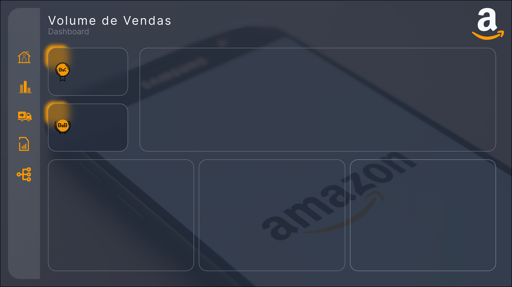

# Dashboard - Análise de Desempenho

## Problema

A empresa enfrentava dificuldades na comparação eficiente de vendas por diferentes canais e na identificação de segmentos lucrativos. Além disso, havia limitações na análise da relação entre quantidade vendida e valor das vendas, prejudicando a identificação de padrões de comportamento do cliente.

## Objetivo do Estudo

O projeto tem como objetivo fornecer uma análise abrangente de dados de desempenho para ajudar a empresa a superar desafios na comparação de vendas por diferentes canais, identificação de segmentos lucrativos e análise da relação entre quantidade vendida e valor das vendas. A meta é melhorar a tomada de decisões estratégicas e operacionais, proporcionando uma visão clara e acionável sobre vários aspectos do desempenho de vendas, logística e produtos.

## Layout Power BI

### Importância da Identidade Visual

Utilizar as cores da Amazon no dashboard é importante porque:

- **Reconhecimento de Marca:** Cria coerência visual e facilita a identificação do dashboard com a Amazon.
- **Confiança e Credibilidade:** Transmite profissionalismo e consistência, aumentando a confiança nos dados.
- **Experiência do Usuário:** A familiaridade com as cores da Amazon torna o dashboard mais intuitivo e agradável de usar.
- **Comunicação de Valores:** Reflete os valores da Amazon, como inovação e foco no cliente, e cria uma conexão emocional.
- **Diferenciação no Mercado:** Destaca o dashboard como um produto único e facilmente reconhecível em relação aos concorrentes.
- **Cultura Organizacional:** Promove unidade e orgulho entre os colaboradores, refletindo a identidade da empresa.

### Cores Utilizadas

Abaixo estão as cores utilizadas no projeto, respeitando a identidade visual da marca, assim como o design das páginas:

### Exemplos de Páginas

- **Capa**
  
  

- **Painel Geral**
  
  

- **Logística**
  
  

- **Volume de Vendas**
  
  

- **Árvore**
  
  

## Insights do Projeto

### 1) Análise de Vendas

- Comparação eficiente das vendas por diferentes canais, possibilitando a identificação de canais mais eficazes ou áreas de melhoria.
- Visualização clara da distribuição de vendas por categoria de produto, facilitando a identificação de segmentos de mercado mais lucrativos.
- Análise da relação entre a quantidade vendida e o valor das vendas, auxiliando na identificação de possíveis correlações ou padrões de comportamento do cliente.

### 2) Desempenho da Logística

- Monitoramento do status dos envios, permitindo uma gestão mais eficiente da cadeia de suprimentos e a identificação de possíveis gargalos.
- Visualização geográfica da distribuição de envios, facilitando o planejamento logístico e a otimização de rotas.
- Comparação dos níveis de serviço de envio por canal de vendas, auxiliando na avaliação da eficácia dos serviços de entrega e na identificação de áreas para melhorias.

### 3) Análise de Produtos

- Identificação dos produtos mais populares com base na quantidade vendida ou na receita gerada, permitindo uma melhor gestão de estoque e estratégias de marketing.
- Visualização da relação entre o tamanho dos produtos e a quantidade vendida, oferecendo insights sobre preferências do cliente e oportunidades de otimização de portfólio.

## Deploy do Projeto

Link de visualização do Dashboard: **[Acesso ao Dashboard](https://app.powerbi.com/view?r=eyJrIjoiZDdiZTU3ZDEtNDI2YS00NDY1LTg0MWItMzA3Mzc4OWQxN2IyIiwidCI6IjE0Y2JkNWE3LWVjOTQtNDZiYS1iMzE0LWNjMGZjOTcyYTE2MSIsImMiOjh9)**

## Tecnologias Utilizadas

